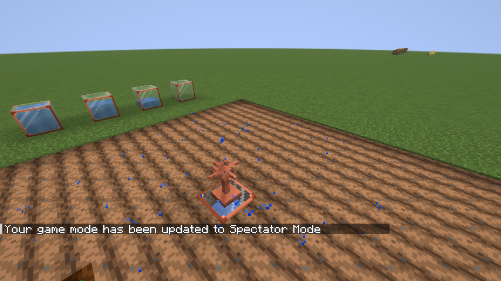
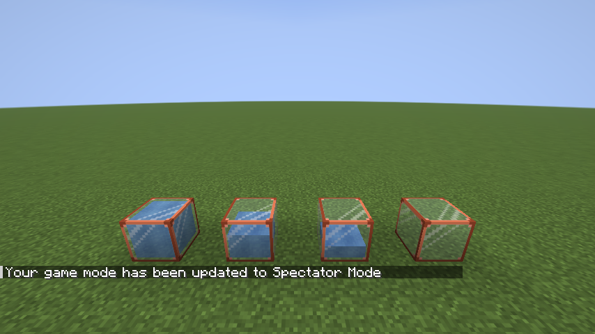
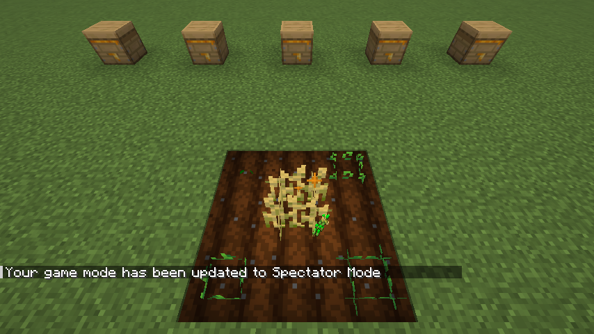

# Better Vanilla Crops

[](https://www.minecraft.net)
[](https://fabricmc.net)
[](https://github.com/xferbe/better-vanilla-crops/actions/workflows/build.yml)
[](LICENSE)
<!-- TODO: Modrinth downloads badge once the project is published:
[](https://modrinth.com/mod/better-vanilla-crops) -->

Your usual wheat, carrots, potatoes and beetroots, but alive: they grow faster in the rain and slower under a roof
or in the snow, like growing next to other crops and beehives, and give more when they were well looked after.
Right-click to harvest and replant. Where it never rains, a copper sprinkler on a water tank does the job.

No new crops, no new foods, no screens.



## Download

Get the jar from the [releases](https://github.com/xferbe/better-vanilla-crops/releases) page. It needs
**Fabric Loader 0.19.5+** and **Fabric API** for Minecraft 26.3, on the server **and** on every client (the water
tank and the sprinkler are new blocks). For a LAN game, both players put the jar in their `mods` folder.

## Features

- **Sun.** Crops without sky light (a roof that is not glass) grow much slower, even with torches.
- **Rain and snow.** Rain falling on a crop speeds it up; snow slows it down.
- **Greenhouses for free.** Glass lets the sun in and keeps rain and snow out, so a glass roof saves crops from the
  snow but loses the rain bonus.
- **Flowing water.** A stream within the vanilla hydration range (4 blocks) helps a bit more than still water.
- **Crop variety.** Each different crop next to a plant speeds it up. Nothing forces you to rotate.
- **Beehives.** Hives and nests within 16 blocks help a little each, more the more honey they hold. Harvesting the
  honey drops the bonus until the bees fill it again.
- **Harvest quality.** How well a crop was looked after while it grew decides its quality when ripe: normal, good
  (+1 product) or excellent (+2 products, so 3 wheat instead of 1). Excellent crops sparkle when ripe.
- **Right-click to harvest.** A ripe crop drops everything it would when broken, replants itself and always gives
  you at least one seed back. Sneak to use your item instead.
- **Water tank and sprinkler.** The sprinkler waters a 9×9 field like rain and keeps the farmland wet with no water
  around. It turns itself off when it rains on it.

Applies to wheat, carrots, potatoes, beetroots, torchflowers, pitcher plants and melon and pumpkin stems (on stems,
also to growing the fruit). Quality and right-click harvest are for wheat, carrots, potatoes and beetroots.

| Water tanks, from full to empty | An excellent wheat sparkling |
| --- | --- |
|  |  |

## Growth

| What | Effect |
| --- | --- |
| No sky light | ×0.4 |
| Rain on the crop, **or** a working sprinkler (they do not add up) | +25% |
| Snow on the crop | ×0.6 |
| Flowing water within 4 blocks | +10% |
| Each different crop in the 3×3 around (up to 3) | +10% |
| Each hive or nest within 16 blocks, by honey level (0 to 5) | up to +3%, at most +15% in total |
| Cap | ×2 |

The vanilla rules still apply underneath: wet farmland, and the penalty for the same crop on every side. Bone meal
is unchanged.

## Quality

Every time a crop grows a stage, the conditions at that moment give it points. Its quality is the average when it
becomes ripe, so keeping a field in good shape the whole time is what pays.

| Points | When |
| --- | --- |
| +1 | Rain on the crop or a working sprinkler |
| +1 | Flowing water nearby |
| +1 / +2 | Crop variety (some / the maximum) |
| +1 / +2 | Beehives with honey (some bonus / at the cap) |
| −1 | No sky light |
| −1 | Snow on the crop |

| Quality | Average | Harvest |
| --- | --- | --- |
| Normal | below 2 | as vanilla |
| Good | 2 or more | +1 product |
| Excellent | 4 or more | +2 products, and the ripe crop sparkles |

It counts however the crop is broken: by a player, a farmer villager, a piston or water. A crop grown with bone
meal, or planted before the mod, uses the conditions of the moment.

## Water tank and sprinkler

The tank takes the place of the water hole in the middle of a classic 9×9 farm, and the sprinkler goes on top of it,
at crop height.

- **Water tank.** Glass with copper corners. Right-click with a water bucket to add one day of watering; it holds 5
  buckets (5 in-game days, about 1h40 of play). You can see the water go down inside the glass, and a comparator
  reads the level.
- **Sprinkler.** With water in the tank below, it waters a 9×9 square (one block up or down too): it counts as rain
  for growth and quality and keeps the farmland wet. It sprays water in a spiral.
- **Turns off in the rain** and uses no water while off. Inside a glass greenhouse it never gets rain, so it stays on.
- **Uses water only while the chunk is active**, which is when crops grow. Skipping the night in a bed uses the water
  for those hours at once.

| Recipe | Shape |
| --- | --- |
| Water Tank | copper ingots in the corners, glass on the sides, empty center (where the water goes) |
| Sprinkler | copper grate on top, a copper ingot in the middle, 3 copper ingots at the bottom |

## Commands and config

`/bvc`, looking at a crop (or the farmland under it), shows what is affecting it right now, the final multiplier and
its quality so far. It only reads, so it needs no permissions.

Every number above is in `config/better-vanilla-crops.json`.

## Adding and removing the mod

- **Adding it** to an existing world works right away. Crops that were already growing use the conditions of the
  moment for their quality.
- **Removing it** leaves your fields as plain vanilla crops. Water tanks and sprinklers disappear, and the quality
  data stored on chunks is dropped.

## Reporting issues

Open an [issue](https://github.com/xferbe/better-vanilla-crops/issues) with the mod version, the Minecraft version,
your `logs/latest.log` and what `/bvc` says about the crop.

## How it works

- **Growth roll.** Vanilla grows a crop when `random.nextInt(n) == 0`, with `n` from its growth speed. A mixin swaps
  that roll for a continuous chance `multiplier / n`. Multiplying the speed instead would not work: vanilla rounds
  `25 / speed` to an integer, and on wet farmland a 25% bonus would vanish in the rounding.
- **Beehives** are found through the game's point of interest index (the one bees use), without scanning blocks.
- **Quality** lives in a Fabric data attachment on the chunk (position → points), so no property is added to vanilla
  blocks. Drops go through both `Block.getDrops` overloads, which every broken block uses.
- **Sprinklers** add themselves to an in-memory index when their block entity loads and leave it when it unloads, so
  a crop or farmland asks "is a working sprinkler near me?" without scanning blocks. Water use follows the day clock,
  so a night skipped in bed is charged at once.

## Building from source

Requires JDK 25.

```bash
./gradlew build              # jar in build/libs
./gradlew runClient          # dev client
./gradlew runClientGameTest  # opens the game, builds test farms, checks every rule, takes screenshots
```

The game test builds farms with an open sky, stone and glass roofs, crop variety, flowing water, a snowy biome,
beehives, an excellent field and a sprinkler on dry farmland. It checks the multipliers in clear weather and in the
rain, grows crops from seed, harvests with right-click, checks drops, water use, a skipped night and the sprinkler
turning off in the rain. Screenshots go to `build/run/clientGameTest/screenshots`.

The water tank textures and its 16 models (one per water height) come from `tools/GenAssets.java`:

```bash
java tools/GenAssets.java
```

## AI disclosure

Contains AI-generated code and text.

## License

MIT, see [LICENSE](LICENSE).
